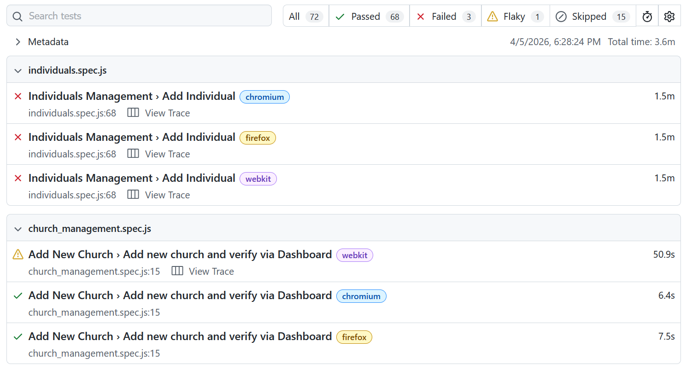
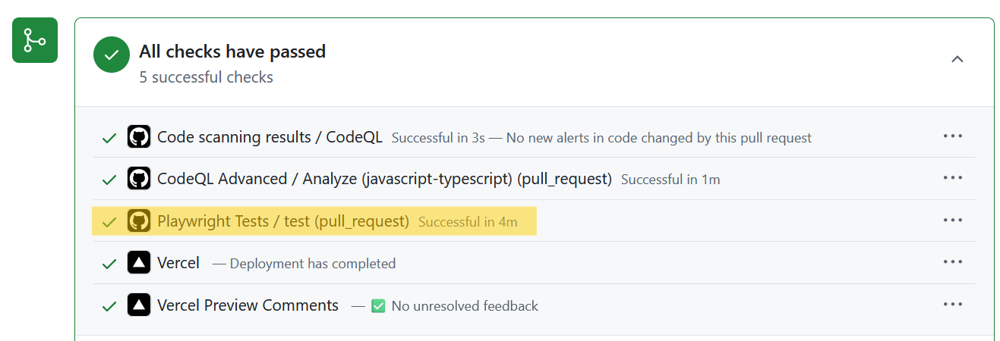

# Testing

## Tools Used
The [Playwright](https://playwright.dev/) library was used for end-to-end testing in this web application.

## Testing Plan
To ensure that our website stays reliable despite changes to the codebase, we have developed a test suite covering all core functionality of the site. When a pull request is submitted by a developer, the test suite automatically runs and flags any features that were broken by the change. This test suite saves a lot of time, allowing us to avoid manually testing each existing feature when new functionality is added. It also guarantees that features which rely on external services (i.e. Supabase or one of the React libraries we are using) are tested regularly and problems are identified in a timely manner.

Results from the test suite, showing passing/failing tests:

Test suite running automatically when a pull request is submitted, showing a check mark to indicate that all tests passed:

## Test Cases
The [Playwright](https://playwright.dev/) test suite is configured to run the following tests with the Firefox, Chromium, and Webkit (Safari) browser engines. All major features of the application are tested, except for the mobile interface and custom form pages, since these are currently experimental and undergoing major changes regularly. With these test cases, we can ensure the functionality of the website for every end user, regardless of their browser.

The following list explains the operations that are executed and verified by each test case.

- Church Pages
    - Add Church Page
        - Add new church with fake data
    - Edit Church Page
        - Edit basic church information (name, city, state, etc.)
        - Add, edit, and delete church notes
        - Edit church's POC (Point of Contact)
        - Edit shoebox counts
        - Edit church relations team member
    - Home Page
        - Filter/search by...
            - County
            - Zip code
            - Church name
            - Minimum shoebox count
            - Year
            - Shoebox count (ascending/descending)
- Individuals Pages
    - Add Individual Page
        - Add new individual with fake data
    - Home Page
        - Filter/search by
            - Name
            - Church name
            - Active/inactive to emails
            - Resources requested
        - Edit individual's...
            - Name
            - Email address
            - Church affiliation
            - Role
            - Birthday
            - Resources Requested
            - Notes
        - Delete individual
        - Copy emails
- Profile Page
    - Edit profile information (name, phone number, address, etc.)
    - Edit church affiliation and member notes
- Team Members Page
    - Home Page
        - Delete team member
        - Copy emails
        - Search by...
            - Name
            - Church
            - County
    - Add Team Member Page
        - Add team member with fake data
    - Edit Team Member Page
        - Change church affiliation and other member data (name, phone number, etc.)